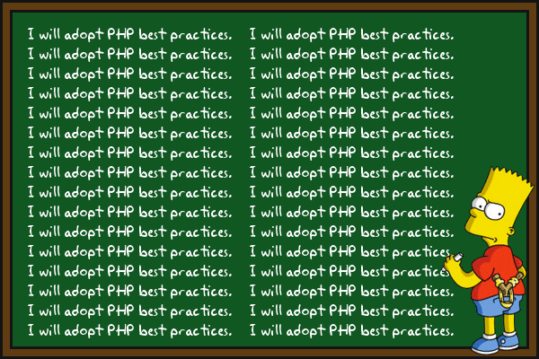

PHP offers a lot of options and styles of writing your code. But as your application grows and
becomes more complex following some good practices is a must if you want to have a maintanable and modern PHP coding
or just want to be a good PHP developer.

Currently there is no official or canonical way of using PHP but over the years of PHP development we can list
some of the PHP best practices that can simplify and improve your coding at the same time.



* [Coding standards](#coding-standards)
* [Use the latest PHP version](#use-the-latest-version)
* [Arrays](#arrays)
* [Composer](#composer)
* [Testing](#testing)
* [Extensions](#extensions)
* [Sending emails](#sending-emails)
* [Passwords](#passwords)

## Coding standards

Use [PSR-1][psr-1] and [PSR-2][psr-2] coding standards.

## Use the latest PHP version

* Use latest stable version. In the time of this writing i.e `PHP 5.6`.

## Arrays

Use short syntax for defining arrays:

```php
$array = [
    "foo" => "bar",
    "bar" => "foo",
];
```

## Composer

In modern PHP we should write less code and since many problems have already been solved use existing solutions and libraries.
[Composer][composer] is a tool for managing your dependencies in a PHP project. Using your terminal you can add, update or remove dependant packages from [packagist.org][packagist]. In your project you create composer.json file and Composer uses it for managing dependant libraries and packages.

## Testing

Always test your code. If you're not familiar with concept of testing start with [PHPUnit][phpunit].

## Extensions

For performance and security reasons it is a good practice to disable/not enable extensions you will not need in your production environment.

## Sending emails

For sending emails there are multiple options in PHP. From using default PHP's [mail()][mail] function to external 3rd party libraries such as [Swift Mailer][swift-mailer] and [PHP Mailer][php-mailer]. Avoid default mail function and use Swift Mailer or PHP Mailer.

## Passwords

Storing passwords must be done with PHP's built-in [password hashing][password-hashing] API.


[psr-1]: http://www.php-fig.org/psr/psr-1/
[psr-2]: http://www.php-fig.org/psr/psr-2/
[composer]: https://getcomposer.org
[packagist]: https://packagist.org
[phpunit]: http://phpunit.de
[mail]: http://php.net/manual/function.mail
[swift-mailer]: http://swiftmailer.org/
[php-mailer]: https://github.com/PHPMailer/PHPMailer
[password-hashing]: http://php.net/manual/en/book.password.php